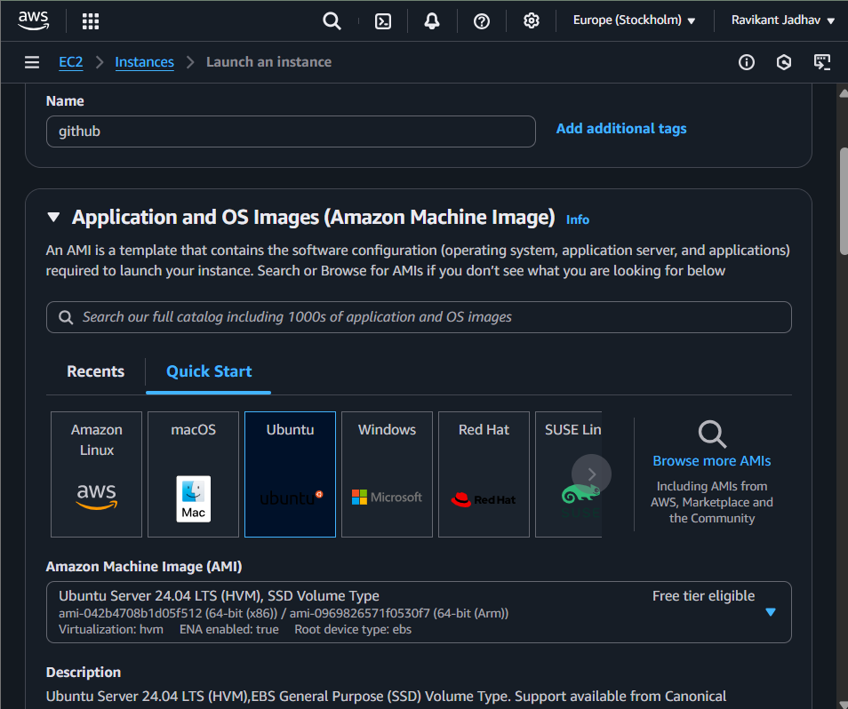
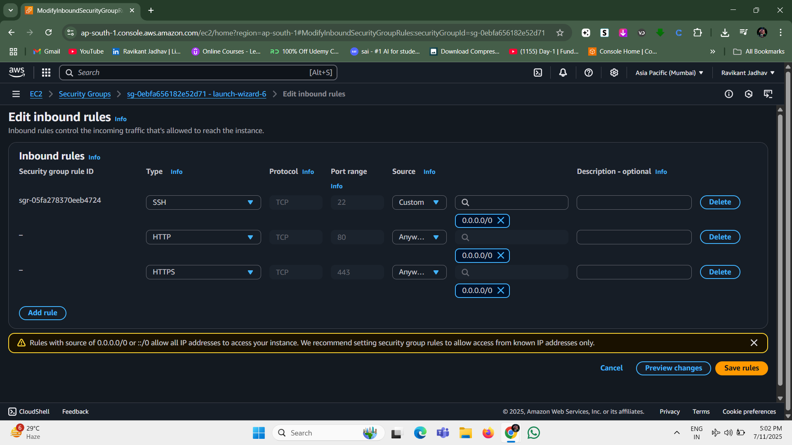
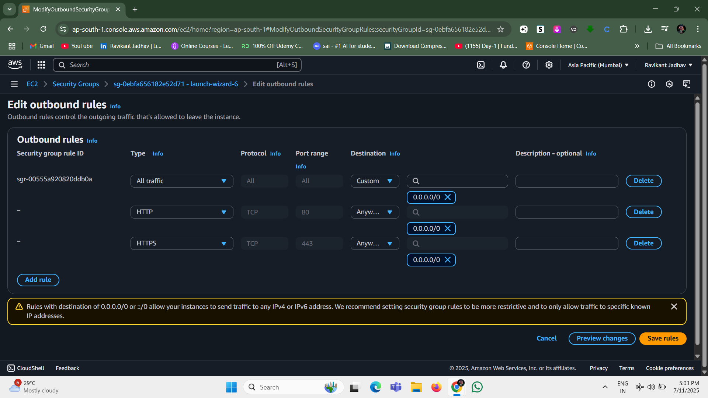
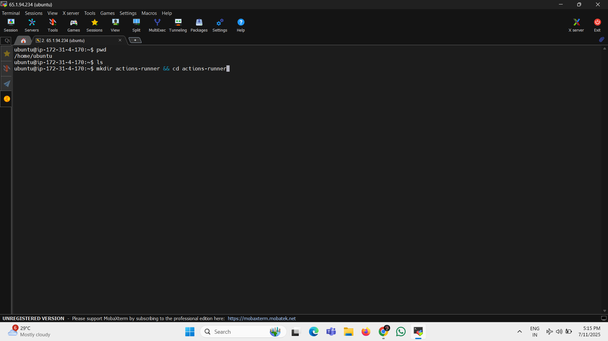
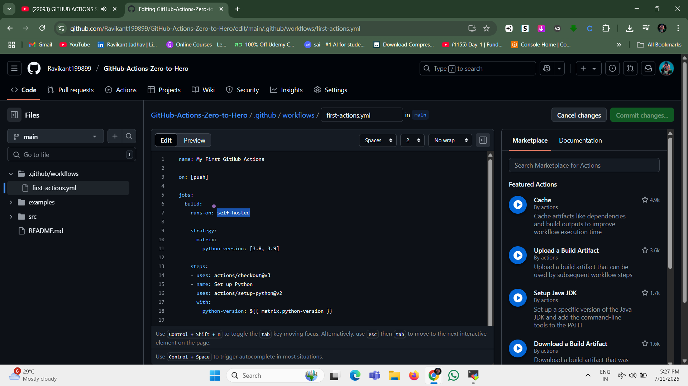
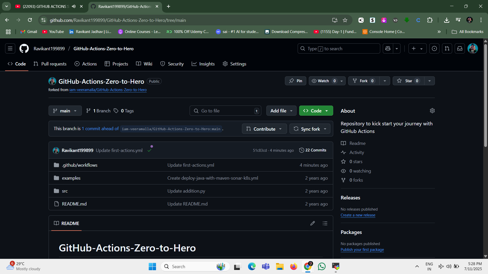
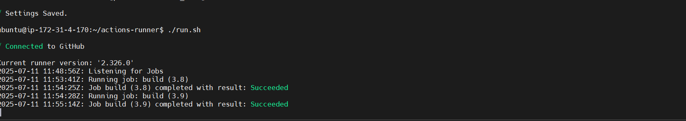

# 🚀 GitHub Actions with Self-Hosted Runners

This repository demonstrates how to configure and use **self-hosted runners** for GitHub Actions. It also includes a comparison with Jenkins and multiple CI/CD workflows implemented through real-world projects.

---

## 📌 Project Overview

✅ Setup and configure **GitHub Actions self-hosted runners**  
✅ Create and run CI/CD pipelines for sample applications  
✅ Compare **GitHub Actions** vs **Jenkins** with real-world use cases  
✅ Add this to your DevOps project portfolio or resume

---

## 🛠️ Tools & Technologies

- GitHub Actions
- Self-Hosted Runners
- Jenkins (for comparison)
- Ubuntu Server / EC2
- Docker (optional)

---

## 📸 Full Setup – Screenshots

Here’s a visual walkthrough of the project setup:

1. **EC2 Launch Instance**  
   

2. **Inbound Rule Configuration (Security Group)**  
   

3. **Outbound Rule Configuration**  
   

4. **Self-Hosted Runner Registered on GitHub**  
   

5. **Action-Runner Directory in EC2**  
   

6. **GitHub Workflow File: `first-action.yml`**  
   

7. **Commit Ahead – Workflow Triggered**  
   

8. **Build Completed Successfully**  
   


---

## ⚙️ How to Set Up a Self-Hosted Runner

### 1. Create a New Runner on GitHub

- Go to your GitHub repo → **Settings → Actions → Runners → Add Runner**
- Choose OS (Linux, Windows, etc.)
- Follow the given commands to download and configure the runner

### 2. Setup on Your Server

```bash
# Example for Ubuntu
mkdir actions-runner && cd actions-runner
curl -o actions-runner-linux-x64-2.316.0.tar.gz -L https://github.com/actions/runner/releases/download/v2.316.0/actions-runner-linux-x64-2.316.0.tar.gz
tar xzf ./actions-runner-linux-x64-2.316.0.tar.gz
./config.sh --url https://github.com/Ravikant199899/DevOps --token YOUR_TOKEN
./run.sh
